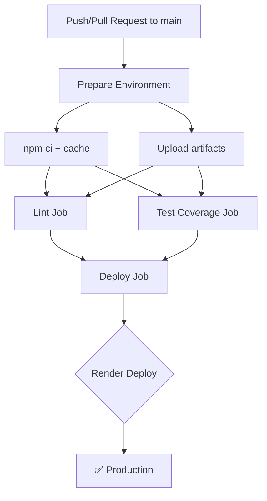

# CI/CD Pipeline - GitHub Actions

Pipeline automatizado de CI/CD para Products API que ejecuta pruebas, análisis de código y despliegue automático en Render.

## Quick Overview

| Job | Platform | Commands | Parallel Execution |
|-----|----------|----------|------------------|
| **prepare** | Ubuntu 18.x | `npm ci` + cache setup | - |
| **lint** | Ubuntu 18.x | `npm run lint` → `npm run lint:html` | ✅ |
| **test-coverage** | Ubuntu 18.x | `npm test` → `npm run test:coverage` | ✅ |
| **deploy** | Ubuntu 18.x | Render API deploy | Only if all pass |

## Pipeline Flow



## Configuration

### Required GitHub Secrets

Configure en `Settings` → `Secrets and variables` → `Actions`:

```bash
RENDER_API_KEY=rw_xxxxxxxxxx     # Tu Render API Key
RENDER_SERVICE_ID=srv-xxxxxxxxx  # Tu Render Service ID
```

### How to get values:

**RENDER_API_KEY:**
1. Go to Render Dashboard → Account Settings → API Keys
2. Generate new key if needed
3. Copy value to GitHub secrets

**RENDER_SERVICE_ID:**
1. Navigate to your Web Service in Render Dashboard
2. Settings → Account
3. Copy the Service ID

## Pipeline Optimization Features

### 🚀 Speed Optimizations
- **Single dependency install**: `npm ci` runs only once in prepare job
- **Shared artifacts**: `node_modules` cached and shared between parallel jobs
- **Native npm cache**: Built-in GitHub Actions npm caching
- **Parallel execution**: lint + test-coverage run concurrently

### 🏗️ Build Efficiency
- **Artifact reuse**: Node modules uploaded once, downloaded when needed
- **Conditional deploys**: Only runs on main branch pushes
- **Smart caching**: Cache key based on package-lock.json hash

### 📊 Quality Gates
- **Lint enforcement**: Pipeline fails if ESLint finds errors
- **Test requirements**: Must pass all unit tests
- **Coverage reporting**: Integrates with Codecov for tracking

## Pipeline Triggers

| Event | Branches | Deploy | Quality Checks |
|-------|----------|--------|----------------|
| `push` | `main` | ✅ | All |
| `push` | `feature/*` | ❌ | All |
| `pull_request` | `main` | ❌ | All |

## Monitoring & Debugging

### GitHub Actions Dashboard
- URL: `https://github.com/[owner]/[repo]/actions`
- Real-time logs during execution
- Download artifacts from failed runs

### Artifacts Available
- `build-environment` - Shared dependencies and source
- `lint-reports/` - ESLint HTML reports  
- `test-coverage-reports/` - Jest + LCOV coverage files

### Local Testing Commands
```bash
# Run pipeline steps locally
npm ci                          # Install dependencies
npm run lint                     # Code quality check
npm test                         # Unit tests
npm run test:coverage           # Coverage analysis

# Docker alternative
./docker-commands.sh
```

## Troubleshooting

### Common Issues

**Build fails on npm ci:**
```bash
rm -rf node_modules package-lock.json
npm install
git add package-lock.json
git commit -m "fix: resolve dependency conflicts"
```

**Lint errors:**
```bash
npm run lint -- --fix           # Auto-fix issues
npm run lint:html               # Generate HTML report
```

**Test issues:**
```bash
npm test -- --verbose           # Verbose test output
npm run test:coverage           # Check coverage locally
open src/test/coverage/lcov-report.html
```

**Deploy problems:**
1. Verify GitHub secrets are configured
2. Check Render service exists and is active
3. Review Render dashboard logs
4. Test API connectivity manually

### Performance Issues
- Check cache hit rates in Actions logs
- Optimize test suite if too slow
- Review artifact sizes

## File Structure

```
.github/workflows/
├── ci-cd.yml              # Main pipeline definition
└── reusable-steps.yml     # Optional shared workflows

src/docs/
├── CI_CD_README.md        # This documentation
└── GITHUB_ACTIONS_GUIDE.md # Detailed troubleshooting
```

## Deployment Process

### Automatic Deploy
1. Code pushed to `main` branch
2. Quality checks pass (lint + tests)
3. Deploy job triggers Render API
4. Service status verified after 30 seconds

### Manual Testing
```bash
# Test Render API connectivity
curl -H "Authorization: Bearer $RENDER_API_KEY" \
  "https://api.render.com/v1/services/$RENDER_SERVICE_ID"

# Trigger manual deploy
curl -X POST \
  "https://api.render.com/v1/services/$RENDER_SERVICE_ID/deploys" \
  -H "Authorization: Bearer $RENDER_API_KEY"
```

## Security Considerations

- ✅ All secrets wrapped in `${{ secrets.VAR }}`
- ✅ No sensitive data in logs
- ✅ Environment protection enabled for production
- ✅ API keys rotation recommended

## Useful URLs

- **Pipeline**: `https://github.com/[owner]/[repo]/actions`
- **Render**: `https://dashboard.render.com`
- **Codecov**: `https://codecov.io/github/[owner]/[repo]`
- **Live API**: `https://[app-name].onrender.com/api-docs`
