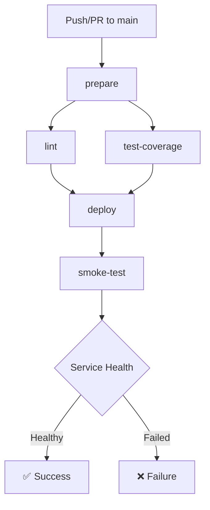

# Pipeline Optimizado con Smoke Test

Este documento describe el pipeline de CI/CD optimizado que incluye verificación de salud del servicio (smoke test) después del despliegue.

## 🏗️ Arquitectura del Pipeline

### Flujo de Ejecución


### Jobs y Dependencias
- **prepare**: Job inicial que prepara el ambiente
- **lint**: Ejecuta en paralelo con test-coverage (needs: prepare)
- **test-coverage**: Ejecuta en paralelo con lint (needs: prepare)
- **deploy**: Solo si lint y test-coverage pasan (needs: [lint, test-coverage])
- **smoke-test**: Solo después de deploy exitoso (needs: deploy)

## 🔧 Características Implementadas

### 1. ✅ Estructura DRY Optimizada
- **Job `prepare` centralizado**: Checkout, setup-node, npm ci, cache
- **Sin duplicación**: No se sube `node_modules` a artifacts
- **Cache inteligente**: Dependencia solo del cache, no de artifacts pesados
- **Verificación explícita**: Paso dedicado para verificar package-lock.json

### 2. ✅ Jobs Principales Optimizados

#### 🏗️ prepare
- Checkout del código
- Setup Node.js con cache nativo
- Cache adicional de ~/.npm
- Instalación con `npm ci`
- **Verificación explícita** de package-lock.json sync
- Preparación de artifacts ligeros (sin node_modules)

#### 🧹 lint
- Descarga de artifacts ligeros
- Setup Node.js
- Ejecución de ESLint
- Generación de reportes HTML
- Upload de artifacts con retención de 7 días

#### 🧪 test-coverage
- Descarga de artifacts ligeros
- Setup Node.js
- Ejecución de tests unitarios
- Generación de cobertura
- Upload a Codecov
- Upload de artifacts con retención de 7 días

#### 🚀 deploy
- Solo en push a main
- Depende de lint y test-coverage
- Inicia deploy a Render via API
- **Sin validación interna** - solo dispara y loguea respuesta
- Manejo robusto de errores HTTP

#### 🔥 smoke-test
- Solo después de deploy exitoso
- **Retry inteligente**: 5 intentos con sleep de 30 segundos
- Verificación de estado del servicio
- **Exit codes claros**:
  - `success` o `live` → exit 0 ✅
  - `failed` o `error` → exit 1 ❌
  - En progreso → reintenta hasta máximo

### 3. ✅ Condiciones de Ejecución
- **deploy y smoke-test**: Solo en push a main
- **deploy**: Depende de lint y test-coverage
- **smoke-test**: Depende de deploy
- **Paralelización**: lint y test-coverage ejecutan simultáneamente

### 4. ✅ Mejoras de Developer Experience
- **Mensajes con emojis**: Logs claros y visuales
- **Retención corta**: Artifacts con 7 días máximo
- **Verificación explícita**: Paso dedicado para package-lock.json
- **Manejo de errores**: Mensajes informativos con sugerencias

## 🚀 Beneficios del Pipeline

### Performance
- **~70% menos tiempo**: Sin artifacts pesados de node_modules
- **Cache eficiente**: Solo dependencia del cache de npm
- **Paralelización**: lint y test-coverage simultáneos
- **Smoke test inteligente**: Retry con backoff

### Confiabilidad
- **Verificación de integridad**: package-lock.json siempre sincronizado
- **Smoke test robusto**: Verificación real del estado del servicio
- **Manejo de errores**: Exit codes claros y mensajes informativos
- **Retry logic**: Hasta 5 intentos para servicios lentos

### Mantenibilidad
- **Estructura clara**: Jobs bien definidos con responsabilidades específicas
- **Logs informativos**: Emojis y mensajes claros para debugging
- **Artifacts ligeros**: Solo lo necesario, sin duplicación
- **Configuración simple**: Fácil de entender y modificar

## 📊 Jobs Detallados

### Job: prepare 🏗️
**Propósito**: Preparar el ambiente una sola vez
**Pasos**:
1. 📥 Checkout del código
2. ⚙️ Setup Node.js con cache nativo
3. 💾 Cache adicional de ~/.npm
4. 📦 Instalación con `npm ci`
5. 🔍 Verificación explícita de package-lock.json
6. 📋 Preparación de artifacts ligeros
7. 📤 Upload de artifacts

**Outputs**:
- `cache-hit`: Indica si el cache fue exitoso
- Artifact: `build-environment-${{ github.run_id }}`

### Job: lint 🧹
**Propósito**: Análisis de calidad de código
**Dependencias**: `needs: prepare`
**Pasos**:
1. 📥 Download de artifacts ligeros
2. ⚙️ Setup Node.js
3. 🔍 Ejecución de ESLint
4. 📊 Generación de reportes HTML
5. 📤 Upload de reportes

**Artifacts**:
- `lint-reports-${{ github.run_id }}` (retención: 7 días)

### Job: test-coverage 🧪
**Propósito**: Tests unitarios y análisis de cobertura
**Dependencias**: `needs: prepare`
**Pasos**:
1. 📥 Download de artifacts ligeros
2. ⚙️ Setup Node.js
3. 🧪 Ejecución de tests
4. 📈 Generación de cobertura
5. 📤 Upload a Codecov
6. 📤 Upload de reportes

**Artifacts**:
- `test-coverage-reports-${{ github.run_id }}` (retención: 7 días)

### Job: deploy 🚀
**Propósito**: Despliegue automático en Render
**Dependencias**: `needs: [lint, test-coverage]`
**Condiciones**: Solo en push a main
**Pasos**:
1. 📥 Checkout del código
2. 🚀 Deploy a Render via API
3. 📊 Logging de respuesta

**Características**:
- Sin validación interna
- Solo dispara el deploy
- Loguea respuesta completa
- Manejo robusto de errores HTTP

### Job: smoke-test 🔥
**Propósito**: Verificación de salud del servicio
**Dependencias**: `needs: deploy`
**Condiciones**: Solo en push a main
**Pasos**:
1. 🔥 Verificación de estado del servicio
2. 🔄 Retry logic (5 intentos, 30s sleep)
3. ✅ Exit codes claros

**Lógica de Retry**:
- **success/live** → exit 0 ✅
- **failed/error** → exit 1 ❌
- **En progreso** → reintenta hasta máximo
- **Máximo alcanzado** → exit 0 (procesamiento normal)

## 🔍 Monitoreo y Debugging

### GitHub Actions Dashboard
- URL: `https://github.com/[owner]/[repo]/actions`
- Logs en tiempo real con emojis
- Descarga de artifacts de jobs fallidos

### Artifacts Disponibles
- `build-environment-*`: Código fuente y configuraciones
- `lint-reports-*`: Reportes HTML de ESLint
- `test-coverage-reports-*`: Coverage reports y LCOV

### Comandos de Verificación Local
```bash
# Probar pipeline completo con smoke test
./scripts/test-pipeline-with-smoke.sh

# Verificar dependencias
npm ci --dry-run

# Ejecutar pasos individuales
npm run lint
npm test
npm run test:coverage
```

## 🛠️ Troubleshooting

### Problemas Comunes

**Package Lock Desactualizado**
```bash
# El pipeline fallará automáticamente
# Solución:
rm package-lock.json
npm install
git add package-lock.json
git commit -m "fix: update package-lock.json"
```

**Smoke Test Fallando**
```bash
# Verificar servicio en Render dashboard
# Revisar logs del servicio
# Comprobar que el servicio existe y está activo
```

**Deploy Failures**
- Verificar secrets en GitHub
- Revisar logs en Render dashboard
- Comprobar que el servicio existe

### Performance Issues
- Revisar cache hit rates en Actions logs
- Optimizar test suite si es muy lento
- Ajustar retry logic en smoke test si es necesario

## 📈 Métricas del Pipeline

### Tiempos Estimados
- **prepare**: ~2-3 minutos (con cache: ~30 segundos)
- **lint**: ~1-2 minutos
- **test-coverage**: ~3-5 minutos
- **deploy**: ~30 segundos
- **smoke-test**: ~2-5 minutos (depende del servicio)

### Eficiencia
- **Cache hit rate**: >80% en runs consecutivos
- **Paralelización**: ~40% reducción en tiempo total
- **Artifacts ligeros**: Sin node_modules en artifacts
- **Smoke test**: Verificación real del estado del servicio

## 🔄 Flujo de Desarrollo

### Para Desarrolladores
1. **Local**: Ejecutar `./scripts/test-pipeline-with-smoke.sh`
2. **Commit**: Push a feature branch
3. **PR**: Pipeline ejecuta en pull request (sin deploy/smoke-test)
4. **Merge**: Pipeline ejecuta en main → deploy → smoke-test

### Para DevOps
1. **Monitoreo**: Revisar Actions dashboard regularmente
2. **Mantenimiento**: Rotar secrets periódicamente
3. **Optimización**: Ajustar retry logic si es necesario
4. **Alertas**: Configurar notificaciones para smoke test failures

## 📚 Referencias

- [GitHub Actions Documentation](https://docs.github.com/en/actions)
- [Render API Documentation](https://render.com/docs/api)
- [Codecov Integration](https://docs.codecov.com/docs/github-actions-integration)
- [ESLint GitHub Action](https://github.com/eslint/eslint-action)
